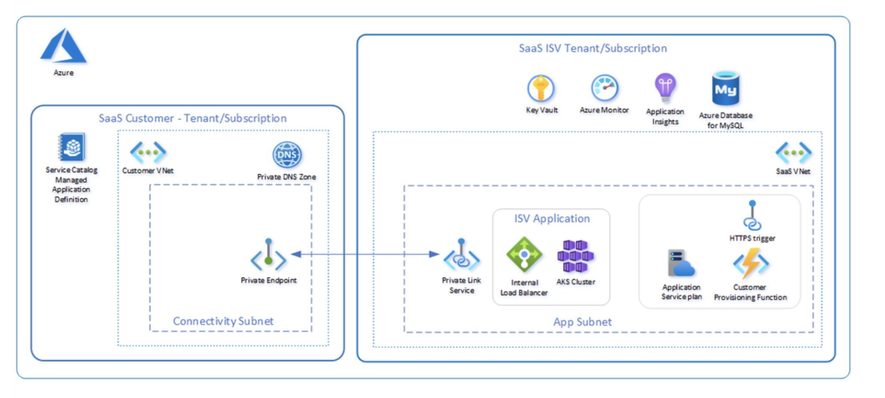
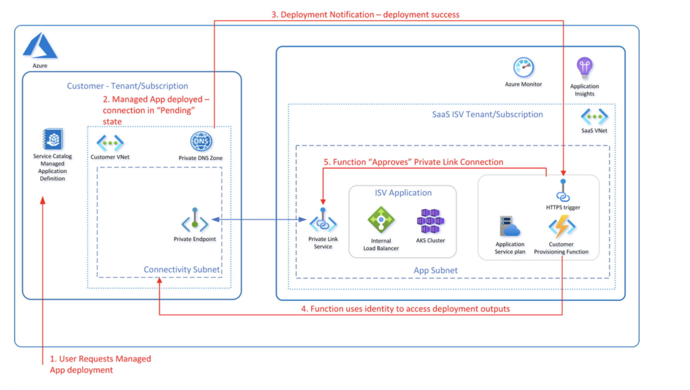
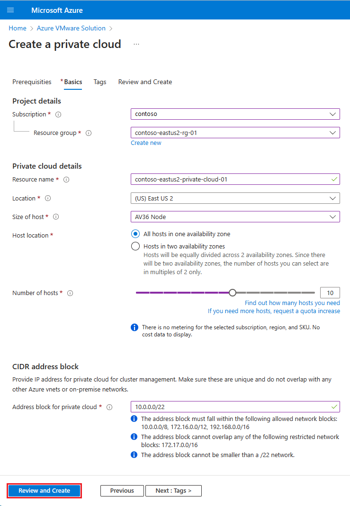
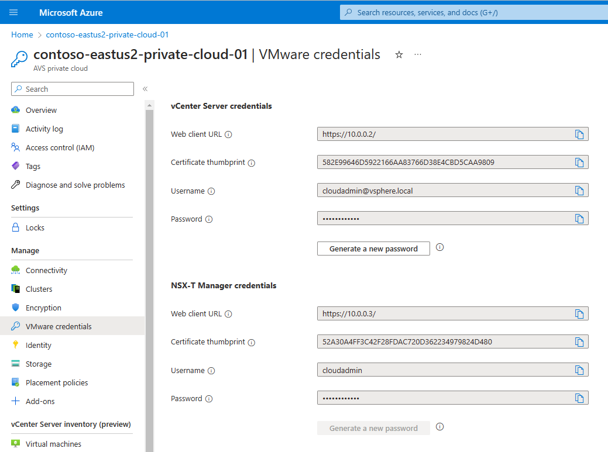

# Private-SaaS:
---------------

* SaaS - Software as a Software
* Private SaaS is a cloud-based software delivery model that provides all the benefits of traditional SaaS, with one key difference, the software runs on a private or dedicated cloud infrastructure rather than a shared public one.
[What is Private SaaS](https://opsverse.io/2022/08/17/what-is-private-saas/)
* Implementing private SaaS requires a cloud infrastructure that is dedicated to the business. This infrastructure can be hosted on-premises, or on a cloud platform 
[Implementing Private SaaS](https://craftercms.com/blog/2023/05/what-is-private-saas#:~:text=Implementing%20private%20SaaS%20requires%20a,Google%20Cloud%20Platform%20(GCP).)
[Implementing Private SaaS](https://techcommunity.microsoft.com/t5/azure-architecture-blog/private-connectivity-pattern/ba-p/2675067)

* The solution described can be used to enable private connectivity from a customer subscription/tenant to a service provider's solution.
* The private connectivity pattern leverages standard Azure components to enable private connectivity between a consumer and a SaaS provider where public outbound connectivity from a consumer tenant and subscription is not permitted or supported.

Implementing a private Software as a Service (SaaS) solution using the Azure cloud involves several steps. Below is a high-level guide to help you get started:

[Creating Private Cloud in Azure](https://learn.microsoft.com/en-us/azure/azure-vmware/tutorial-create-private-cloud?tabs=azure-portal#create-a-private-cloud)
[Accessing the Private Cloud in Azure](https://learn.microsoft.com/en-us/azure/azure-vmware/tutorial-access-private-cloud)
[Configuring Networking for Private Cloud Azure](https://learn.microsoft.com/en-us/azure/azure-vmware/tutorial-configure-networking)
[Creating NSX-T Network segment](https://learn.microsoft.com/en-us/azure/azure-vmware/tutorial-nsx-t-network-segment)

* Define Requirements:
----------------------
Clearly outline the requirements for your private SaaS, including features, scalability, security, and integration with other systems.

* Azure Subscription:
---------------------
Set up an Azure account and subscription if you don't have one already. You can do this on the Azure portal.

* Choose Azure Services:
------------------------
Select Azure services that align with your requirements. Common services for building private SaaS solutions include Azure App Service, Azure SQL Database, Azure Virtual Network, Azure Active Directory, and more.

* Design Architecture:
----------------------
Plan the architecture of your private SaaS solution on Azure. Consider factors such as virtual machine (VM) sizes, network configuration, and data storage options. Azure Resource Manager (ARM) templates can be used for infrastructure as code.

* Develop the Application:
--------------------------
Build your SaaS application using Azure-compatible technologies. This might include using Azure Functions, Azure Web Apps, or deploying containers with Azure Kubernetes Service (AKS).

* Security Considerations:
---------------------------
Implement Azure Active Directory for user authentication and access control. Utilize Azure Key Vault for securely storing sensitive information such as connection strings and API keys. Implement Azure Security Center for continuous security monitoring.

* Data Storage:
---------------
Choose appropriate Azure services for data storage. Azure SQL Database, Azure Cosmos DB, or Azure Storage are common choices. Ensure that data at rest and in transit is encrypted.

* Networking:
-------------
Configure Azure Virtual Network to isolate your SaaS solution and control traffic flow. Use Network Security Groups (NSGs) to define rules for inbound and outbound traffic.

* Integration:
--------------
If your organization uses other Azure services or external systems, set up appropriate integrations. Azure Logic Apps or Azure Service Bus can facilitate communication between different components.

* Monitoring and Logging:
-------------------------
Implement Azure Monitor and Azure Log Analytics for monitoring your application's performance, health, and usage. Set up alerts for critical events.

* Deployment:
-------------
Deploy your application to Azure. This can be done through continuous integration and continuous deployment (CI/CD) pipelines using Azure DevOps, GitHub Actions, or other CI/CD tools.

* Scale and Load Balancing:
---------------------------
Configure auto-scaling for your application to handle varying workloads. Use Azure Load Balancer to distribute traffic across multiple instances.

* Testing:
----------
Conduct thorough testing, including functional testing, performance testing, and security testing, to ensure the reliability of your private SaaS.

* Cost Management:
------------------
Monitor and manage costs effectively by leveraging Azure Cost Management tools. Optimize resource utilization and choose cost-effective Azure services based on your application's needs.

* Backup and Disaster Recovery:
--------------------------------
Implement backup and disaster recovery plans using Azure Backup and Azure Site Recovery to protect your data and ensure business continuity.

* For creating the private cloud in Azure 1st we need to set up Azure VMware Solution in a separate Azure subscription this will cost around $20k per month and varies based on the paln we select  
[Creating Azure VMware Solution](https://learn.microsoft.com/en-us/azure/azure-vmware/tutorial-create-private-cloud?tabs=azure-portal)

* Then we need to access the private cloud (VMware Solution) for that we need to configure the VMware solution.
[Access an Azure VMware Solution private cloud](https://learn.microsoft.com/en-us/azure/azure-vmware/tutorial-access-private-cloud)

* Azure VMware Solution doesn't allow us to manage your private cloud with your on-premises vCenter Server. Instead, we need to connect to the Azure VMware Solution vCenter Server instance through a jump box.
* Then we need to connect the vCenter Server of your private cloud

* Then we need to Configure networking for our VMware private cloud in Azure
[Configure networking for VMware private cloud in Azure](https://learn.microsoft.com/en-us/azure/azure-vmware/tutorial-configure-networking)
* Then we need to connect to the private cloud manually and do the necessary configurations.

* Then we need to Add an NSX-T Data Center network segment in Azure VMware Solution.

* After deploying Azure VMware Solution, you can configure an NSX-T Data Center network segment from NSX-T Manager or the Azure portal. Once configured, the segments are visible in Azure VMware Solution, NSX-T Manager, and vCenter Server. NSX-T Data Center comes pre-provisioned by default with an NSX-T Data Center Tier-0 gateway in Active/Active mode and a default NSX-T Data Center Tier-1 gateway in Active/Standby mode. These gateways let you connect the segments (logical switches) and provide East-West and North-South connectivity.
[Add an NSX-T Data Center network segment in Azure VMware Solution](https://learn.microsoft.com/en-us/azure/azure-vmware/tutorial-nsx-t-network-segment)

* Now, we are trying to set up the priavte environment by creating a new subscription in Azure and provisioning the infra under a new vNet under the newly created subscription.

Setting up a private Software as a Service (SaaS) involves several steps to ensure that the software is hosted and accessible exclusively for your organization's internal use. Below is a general guide to help you set up a private SaaS:

* Define Requirements:
----------------------
    Clearly outline the requirements for your private SaaS, including features, customization options, scalability, security measures, and integration capabilities.

* Choose Software Stack:
------------------------
    Select the appropriate technology stack for your SaaS application, considering factors such as programming languages, databases, and frameworks that align with your organization's preferences and expertise.

* Design the Architecture:
--------------------------
    Plan the architecture of your SaaS solution, including the infrastructure setup, network configuration, and server deployment strategy. Decide whether you'll host the solution on-premises or in a private cloud.

* Develop the Application:
--------------------------
    Begin the development process based on your defined requirements and chosen technology stack. Ensure that the application is designed to be scalable, maintainable, and secure.

* Implement Security Measures:
------------------------------
    Implement robust security measures to protect your private SaaS. This includes encryption, access controls, authentication, and regular security audits. Consider compliance with industry regulations if applicable.

* Set Up Hosting Environment:
-----------------------------
    Depending on your hosting choice, set up the necessary infrastructure. This may involve configuring on-premises servers or provisioning resources in a private cloud environment (e.g., AWS, Azure, or Google Cloud).

* Database Configuration:
-------------------------
    Configure and optimize the database for your SaaS application. Ensure data integrity, implement regular backups, and consider disaster recovery plans.

* Integration with Existing Systems:
------------------------------------
    If your organization uses other software systems, ensure that your private SaaS can integrate seamlessly with them. This might involve API development or using middleware solutions.

* User Authentication and Access Control:
-----------------------------------------
    Implement user authentication mechanisms and access control features to manage user permissions effectively. This is crucial for ensuring that only authorized personnel can access the SaaS application.

* Monitoring and Logging:
-------------------------
    Set up monitoring tools and logging mechanisms to track the performance, usage, and potential issues within your private SaaS. This helps in identifying and addressing issues proactively.

* Testing:
----------
    Conduct thorough testing, including unit testing, integration testing, and user acceptance testing, to ensure that the private SaaS meets your organization's requirements and is free of critical issues.

* Deployment:
-------------
    Deploy the private SaaS application to your hosting environment. Monitor the deployment process to catch any issues that may arise during or after deployment.

Note:
-----
* When we go with on-premises private SaaS we may not achieve everything which cloud offers like Autoscaling.

